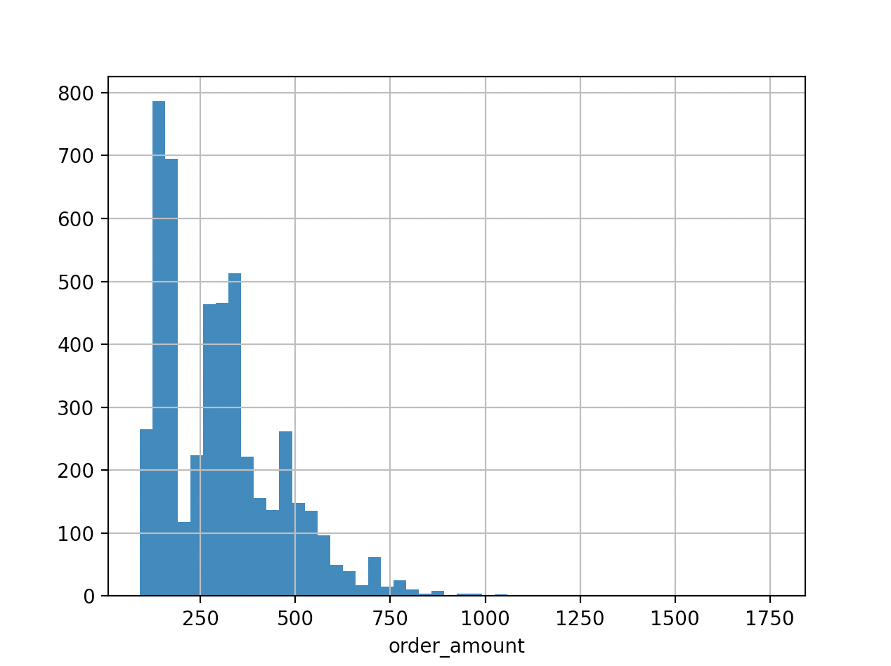
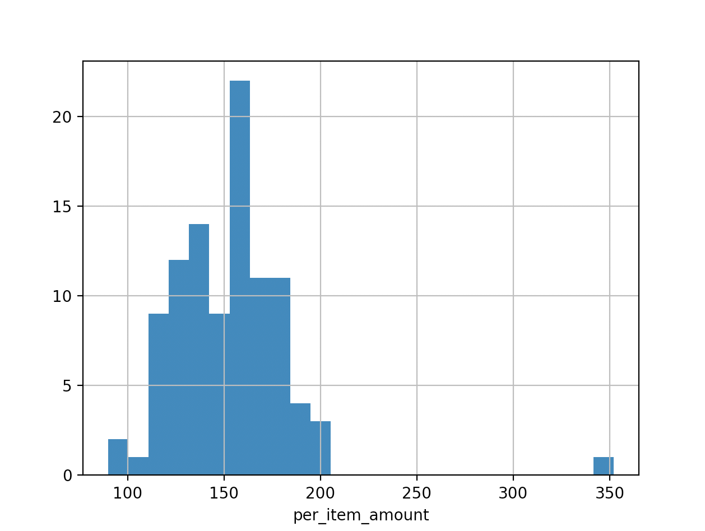
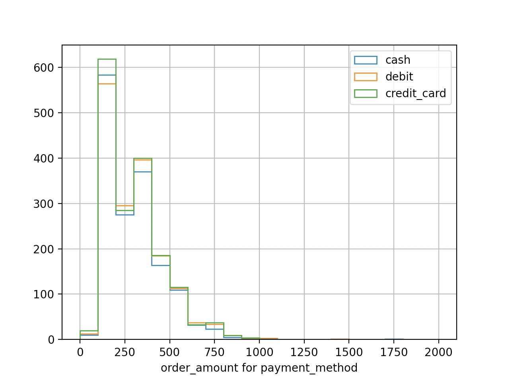
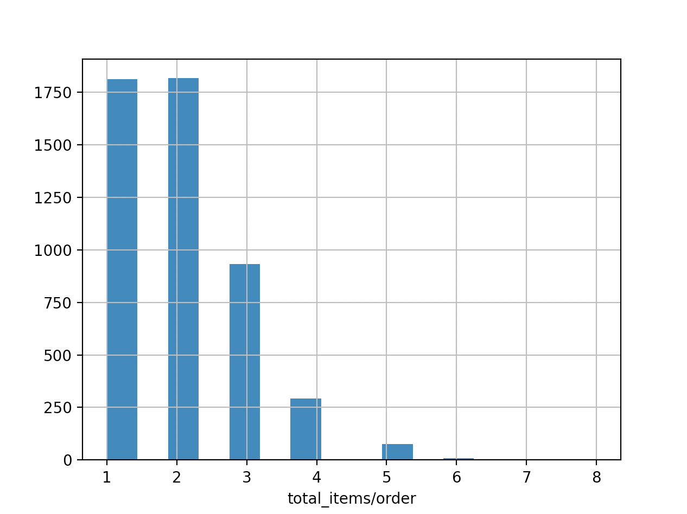
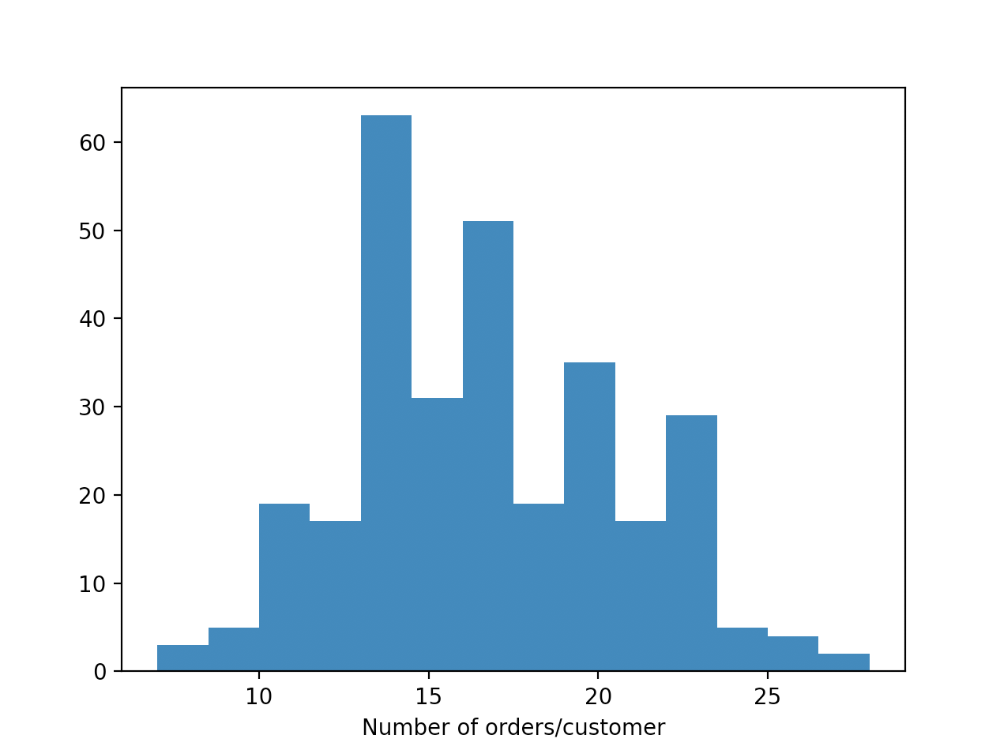
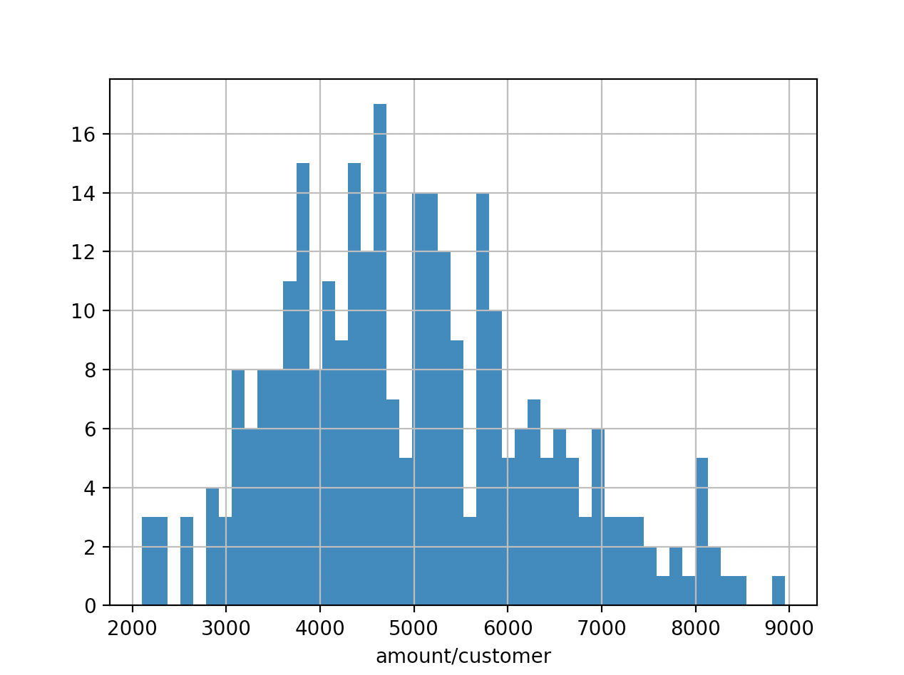

# Shopify Technical Challenge Submission

[Link to the problem](https://docs.google.com/document/d/13VCtoyto9X1PZ74nPI4ZEDdb8hF8LAlcmLH1ZTHxKxE/edit#)

## Q1-a) Think about what could be going wrong with our calculation. Think about a better way to evaluate this data.
The problem of AOV being $3145.13 looks like coming from two reasons, both with very high order_amount. These two reasons are listed below:

   1. There are 17 entries with 2000 items/order, resulting in abnormally high order_amount of $70,400/order. To isolate these entries, a flag called *is_biz_like* has been created with this condition "total_items>10". The table below is the result of the selection "is_biz_like==True". The name of this flag was based on the assumption that high number of items in one order was for the buisiness (resale) purpose. However, given the frequency of the order and the same shop_id and user_id repeated at 4:00 every time, they could be fraudulent activities. If they were real data seen by me, I would initiate an investigation to confirm they are the legit activities.
<details>
  <summary>Click to expand/collapse the table.</summary>

```
      order_id  shop_id  user_id  order_amount  total_items payment_method          created_at  is_biz_like  per_item_amount  is_rare
15          16       42      607        704000         2000    credit_card  2017-03-07 4:00:00         True            352.0    False
60          61       42      607        704000         2000    credit_card  2017-03-04 4:00:00         True            352.0    False
520        521       42      607        704000         2000    credit_card  2017-03-02 4:00:00         True            352.0    False
1104      1105       42      607        704000         2000    credit_card  2017-03-24 4:00:00         True            352.0    False
1362      1363       42      607        704000         2000    credit_card  2017-03-15 4:00:00         True            352.0    False
1436      1437       42      607        704000         2000    credit_card  2017-03-11 4:00:00         True            352.0    False
1562      1563       42      607        704000         2000    credit_card  2017-03-19 4:00:00         True            352.0    False
1602      1603       42      607        704000         2000    credit_card  2017-03-17 4:00:00         True            352.0    False
2153      2154       42      607        704000         2000    credit_card  2017-03-12 4:00:00         True            352.0    False
2297      2298       42      607        704000         2000    credit_card  2017-03-07 4:00:00         True            352.0    False
2835      2836       42      607        704000         2000    credit_card  2017-03-28 4:00:00         True            352.0    False
2969      2970       42      607        704000         2000    credit_card  2017-03-28 4:00:00         True            352.0    False
3332      3333       42      607        704000         2000    credit_card  2017-03-24 4:00:00         True            352.0    False
4056      4057       42      607        704000         2000    credit_card  2017-03-28 4:00:00         True            352.0    False
4646      4647       42      607        704000         2000    credit_card  2017-03-02 4:00:00         True            352.0    False
4868      4869       42      607        704000         2000    credit_card  2017-03-22 4:00:00         True            352.0    False
4882      4883       42      607        704000         2000    credit_card  2017-03-25 4:00:00         True            352.0    False
```
</details>

  2. There are 46 entries with abnormally high order_amount. Although these entries don't have high number of items/order like the first case, the order_mount is very high due to the single item price of $$25,725. To isolate these entries, *is_rare* flag has been defined with "per_item_amount>1000", where *per_item_amount* is order_amount/total_items. The name 'rare' is based on the asumption that these sneakers are rare or vintage, hence the high price. Although these entries all come from shop_id of 78, the user_id are all different (wtih the exception of user_id 855 who made two transactions) with diffrent types of payment_method, they all look legit.
<details>
  <summary>Click to expand/collapse the table.</summary>
  
```
      order_id  shop_id  user_id  order_amount  total_items payment_method           created_at  is_biz_like  per_item_amount  is_rare
160        161       78      990         25725            1    credit_card   2017-03-12 5:56:57        False          25725.0     True
490        491       78      936         51450            2          debit  2017-03-26 17:08:19        False          25725.0     True
493        494       78      983         51450            2           cash  2017-03-16 21:39:35        False          25725.0     True
511        512       78      967         51450            2           cash   2017-03-09 7:23:14        False          25725.0     True
617        618       78      760         51450            2           cash  2017-03-18 11:18:42        False          25725.0     True
691        692       78      878        154350            6          debit  2017-03-27 22:51:43        False          25725.0     True
1056      1057       78      800         25725            1          debit  2017-03-15 10:16:45        False          25725.0     True
1193      1194       78      944         25725            1          debit  2017-03-16 16:38:26        False          25725.0     True
1204      1205       78      970         25725            1    credit_card  2017-03-17 22:32:21        False          25725.0     True
1259      1260       78      775         77175            3    credit_card   2017-03-27 9:27:20        False          25725.0     True
1384      1385       78      867         25725            1           cash  2017-03-17 16:38:06        False          25725.0     True
1419      1420       78      912         25725            1           cash  2017-03-30 12:23:43        False          25725.0     True
1452      1453       78      812         25725            1    credit_card  2017-03-17 18:09:54        False          25725.0     True
1529      1530       78      810         51450            2           cash   2017-03-29 7:12:01        False          25725.0     True
2270      2271       78      855         25725            1    credit_card  2017-03-14 23:58:22        False          25725.0     True
2452      2453       78      709         51450            2           cash  2017-03-27 11:04:04        False          25725.0     True
2492      2493       78      834        102900            4          debit   2017-03-04 4:37:34        False          25725.0     True
2495      2496       78      707         51450            2           cash   2017-03-26 4:38:52        False          25725.0     True
2512      2513       78      935         51450            2          debit  2017-03-18 18:57:13        False          25725.0     True
2548      2549       78      861         25725            1           cash  2017-03-17 19:36:00        False          25725.0     True
2564      2565       78      915         77175            3          debit   2017-03-25 1:19:35        False          25725.0     True
2690      2691       78      962         77175            3          debit   2017-03-22 7:33:25        False          25725.0     True
2773      2774       78      890         25725            1           cash  2017-03-26 10:36:43        False          25725.0     True
2818      2819       78      869         51450            2          debit   2017-03-17 6:25:51        False          25725.0     True
2821      2822       78      814         51450            2           cash  2017-03-02 17:13:25        False          25725.0     True
2906      2907       78      817         77175            3          debit   2017-03-16 3:45:46        False          25725.0     True
2922      2923       78      740         25725            1          debit  2017-03-12 20:10:58        False          25725.0     True
3085      3086       78      910         25725            1           cash   2017-03-26 1:59:27        False          25725.0     True
3101      3102       78      855         51450            2    credit_card   2017-03-21 5:10:34        False          25725.0     True
3151      3152       78      745         25725            1    credit_card  2017-03-18 13:13:07        False          25725.0     True
3167      3168       78      927         51450            2           cash  2017-03-12 12:23:08        False          25725.0     True
3403      3404       78      928         77175            3          debit   2017-03-16 9:45:05        False          25725.0     True
3440      3441       78      982         25725            1          debit  2017-03-19 19:02:54        False          25725.0     True
3705      3706       78      828         51450            2    credit_card  2017-03-14 20:43:15        False          25725.0     True
3724      3725       78      766         77175            3    credit_card  2017-03-16 14:13:26        False          25725.0     True
3780      3781       78      889         25725            1           cash  2017-03-11 21:14:50        False          25725.0     True
4040      4041       78      852         25725            1           cash  2017-03-02 14:31:12        False          25725.0     True
4079      4080       78      946         51450            2           cash  2017-03-20 21:14:00        False          25725.0     True
4192      4193       78      787         77175            3    credit_card   2017-03-18 9:25:32        False          25725.0     True
4311      4312       78      960         51450            2          debit   2017-03-01 3:02:10        False          25725.0     True
4412      4413       78      756         51450            2          debit   2017-03-02 4:13:39        False          25725.0     True
4420      4421       78      969         77175            3          debit  2017-03-09 15:21:35        False          25725.0     True
4505      4506       78      866         25725            1          debit  2017-03-22 22:06:01        False          25725.0     True
4584      4585       78      997         25725            1           cash  2017-03-25 21:48:44        False          25725.0     True
4715      4716       78      818         77175            3          debit   2017-03-05 5:10:44        False          25725.0     True
4918      4919       78      823         25725            1           cash  2017-03-15 13:26:46        False          25725.0     True
```
</details>

After excluding these entries with abonormally high order_amount, the distribution of order amount looks like below. <br>
 <br>
The AOV calculated is: 302.58 (with std = 160.80), which looks OK.

## Q1-b) What metric would you report for this dataset?
   1. To isolate the second item in a), the per_item_amount was defined as "order_amount/total_items".
   1. order_amount for different payment methods, assuming that there may be different patterns or tendency for cash/debit/credit.
   1. total_items / order: number of total items per order.
   1. Number of orders per user.
   1. Total amount per user. Total amount spent by user.

These numbers above correspond to the *analysis_type* defined in Q1_analysis.py, which can be given as an argument.

## Q2-c) What is its value?
   The following analysis was carried out after excluding entries explained in a), assuing that the term 'user' corresponds to customer, not a shop employee.
   1. **per_item_amount** (defined as order_amount/total_items), plotted for all shops (99 entries) <br>
       <br>
      mean = 152.26, std = 31.26 <br>
      Looks OK.
   1. **order_amount for different payment methods:**, plotted for all orders (4937 entries)<br>
       <br>
      mean values for cash, debit and credit card were 297.97, 308.18, and 301.46, respectively. <br>
      Similar distributions for all of them.
   1. **total_items / order:**, plotted for all orders (4937 entries)<br>
       <br>
      mean = 1.995, std = 0.983 <br>
      Looks OK.
   1. **Number of orders / user**, plotted for all users (300 entries) <br>
       <br>
      mean = 16.46, std = 3.985 <br>
      The number of orders per user within a month averages 16-17. Tis seems too high.
   1. **Total amount / user**, plotted for all users (300 entries) <br>
       <br>
      mean = 4979.47, std = 1369.72 <br>
      Not only the number of orders, the total amount spent per user also averages very high, nearly $5,000. Even the user with the minimum total spent > $2,000. These orders may be all made by resellers, or fraudulent. From this quantity and also the one above, this dataset seems to be highly biased with very high number of orders and the total amount spent in a month.

To further follow up, I would study the frequency of the order next but more data would help further study this dataset.

## Q2)
Please find my answers in the seprarate folder Q2 in this repository.
